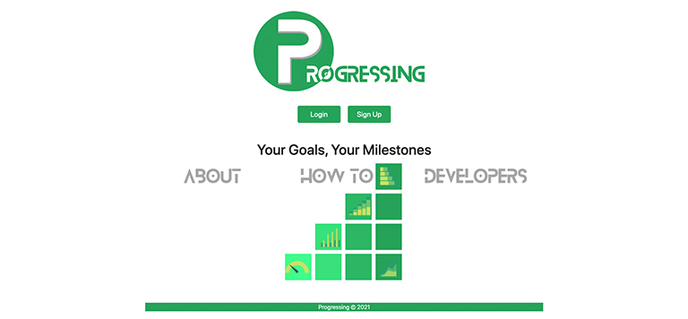

# [Progressing](https://progressing-pod10.herokuapp.com/)

    
    
    
    

## Project Team

- [Bryson](https://github.com/Bryson-Palmer)
- [Ian](https://github.com/Ianaac27)
- [Ilya](https://github.com/ilya-libershteyn)
- [Josh](https://github.com/JJHPhoto)
- [Thomas](https://github.com/Tskading)

## Application Descrition

Our application lets you to track your progress on life goals that you set!

## Application Demo

To watch a video of the application being fully demo'd please use this link: [Application Demo](...).

## Future Development

- Create sharable templates that users could share with each other.
- Create a leaderboard of users. This would be an opt-in option. If some users wanted to compete with their friends or peers to see who could accomplish goals this could be fun for motivation. We would have to make sure that the users could decide how much goals are worth to the entire group on the leaderboard.
- We wanted to create badges that would stay on a user's profile to show them how much they have accomplished. This would be a fun reminder for the user.
- We want to be able to remind our users if they are past a deadline for a goal they made. This would be done in a friendly way with the option to change their deadline.
- We would like to have some animations whenever the user would create and or accomplish a goal. This would let the user know that their goal has been submitted and not keep clicking the submit button if the app lags.
- We want to add a rich text editor to our Notes component. We think that this would make taking notes inside our app more enjoyable for the user.
- Create a PWA of our website.
- Have a forgotten password system.

## Technologies Used

  
  
  
  
  
  
  
  
  
  
  
  

## Resources

[Shields.io](https://shields.io/)

[React Icons](https://react-icons.github.io/react-icons/)

[Font Awesome](https://fontawesome.com/)

[Screencastify](https://www.screencastify.com/)

## Our Workflow

The first thing we did was install our server and client React apps and pushed those to our repo. We also deleted unnecessary React parts from the initial React install.

The next thing we did was work on creating our components and page. We put some test text on each part to see if we were linking to the correct part. We linked our pages to each other with some test buttons so that we could navigate around our app.

Next we tried to get our user authentication working. This proved more difficult than expected but we got parts of it to work. We needed help from our instructor to get our routes working inside of our app.

Once we had that working, we started to try and pass user authenticated data to our database. This also took some time as we were a bit confused by how to route our api requests.

We had a test demo a week before our presentation. So we wanted to have a working MVP for that so that we could get feedback from our peers before we presented the following week. We decided this would be our first spring. We wanted to be able to do a few things:

- Signup
- Get logged in
- Create a goal
- Get sent back to our logged in "home" page
- On that page we'd have our newly created goal with a chart displaying our progress.

Once we had that working, we were able to build in more components. This let us make our user's login page more customized. With this in place, we were eager to present to our peers to get some feedback before our last sprint.

After we had some feedback, we focused on getting our MVP. We were having some Heroku deployment issues as well as having to update the routes to our database. We pushed through and were able to start focusing on styling our MVP with a few days left till presentation. With our MVP in sight, we had a good discussion on what we could accomplish before presenting. We decided that a few of our ambitions goals would be for future development.
